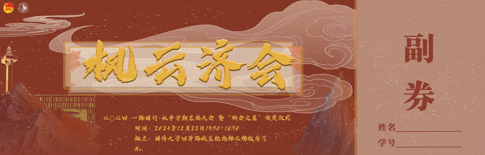

### 行业运营｜商家 & 商品运营｜搜索运营｜产品运营  
### Industry Operations · Merchant & Product Operations · Search Operations · Product Operations

**2027届同济大学应届硕士** · Master's Candidate, Tongji University · Class of 2027

<a href="#中文">中文</a> · <a href="#english">English</a>

 

---

## 🌈 中文

### 👋 关于我
**2027届同济大学应届硕士**，求职方向为**行业运营、商家 & 商品运营、搜索运营与产品运营**。我喜欢把零散的商家、商品和用户信号，变成可执行的增长动作。

目前积累了小红书 Redshop 跨境商家运营、丝芙兰电商站点优化、得物美妆商品运营经验；也持续用 AI 工具优化运营流程。

### 🧩 能力关键词
`商家分层与 BD` · `选品与竞品分析` · `商品价格力` · `促销转化` · `搜索运营` · `漏斗/NPS 分析` · `SQL` · `Excel` · `AI Agent` · `PS / AI`

### 🚀 代表经历

| 🧭 场景 | 我做了什么 | 结果 |
| :--- | :--- | :--- |
| **Redshop 跨境商家运营** | 覆盖 5 个一级类目、600+ 商家；选商、陪跑与活动转化 | 筛选 100+ P0 商家；重点 BD 池出单率 20%+ |
| **丝芙兰站点优化** | 搜索诊断、AI 搜索上线测试、NPS 洞察 | Q2 搜索 CTR +1.48pts；7 月相关负反馈 -20% |
| **得物商品运营** | 美妆/个护/母婴价格力与补贴运营 | 直播间价优率 50%→60%；活动 GMV 同比 +26.93% |

### 🗂️ 作品集

<b>🤖 AI 辅助跨境商家运营工作台</b> · 从商机到跟进动作的可复用流程

 

`商家/类目信号` → `潜力筛选` → `商家分层` → `商品·价格·内容·履约诊断` → `BD 跟进`

用 AI 辅助整理重复研究与诊断环节，让选商和跟进更聚焦。仅展示工作流，不含内部数据或商家敏感信息。

<b>🧸 跨境手作商家运营方案</b> · 模拟案例

 

围绕毛毡玩偶工作室，完成海外机会判断、首次触达、顾虑处理与轻量起步方案；重点是把“为什么值得做、怎么低成本试水”说清楚。

`商家调研` · `BD 话术` · `跨境定位` · `内容/商详优化`

<b>🎨 「枫云济会」校园活动视觉系统</b> · PS 设计

 

<table><tr>
<td width="33%" align="center"> 主视觉</td>
<td width="33%" align="center"> 票券延展</td>
<td width="33%" align="center"> 完整入场券</td>
</tr></table>

从主视觉到票券物料的完整延展，兼顾国风氛围、信息层级与线下活动使用场景。

<b>✍️ 公众号内容编辑与排版</b>

 

[阅读推文：上海浦东棋杆村的农旅融合新道路 →](https://mp.weixin.qq.com/s/B8SFT9YUrCLJ3-6GoKnF1A)

`选题研究` · `长文写作` · `移动端排版`

### 🎧 内容创作
从 0 运营 Bilibili ASMR 账号，峰值粉丝 **4,700+**、累计播放 **35.6 万**；独立完成选题、视频制作与社群运营。  
[访问我的 Bilibili 主页 →](https://space.bilibili.com/178619934?spm_id_from=333.1007.0.0)

### 📬 联系我
`1214594354@qq.com` · 上海 / 安徽 · 正在寻找电商与平台运营相关机会

 

---

## 🌍 English

### 👋 About Me
**2027 master's candidate at Tongji University**, pursuing opportunities in **industry operations, merchant & product operations, search operations and product operations**. I turn merchant, product and user signals into practical growth actions.

Experience across cross-border merchant growth at **Redshop**, e-commerce site optimization at **Sephora**, and beauty category operations at **Dewu** — with a strong interest in AI-enabled operational workflows.

### 🧩 Skills
`Merchant Growth & BD` · `Category Operations` · `Pricing & Benchmarking` · `Promotion Conversion` · `Search Operations` · `Funnel / NPS Analysis` · `SQL` · `Excel` · `AI Agents` · `Photoshop / Illustrator`

### 🚀 Highlights

| 🧭 Experience | Scope | Impact |
| :--- | :--- | :--- |
| **Redshop · Cross-border Merchant Ops** | 5 categories, 600+ merchants | 100+ P0 merchants identified; 20%+ order rate in key BD pool |
| **Sephora · Site Optimization** | Search, AI-search testing, NPS | Search CTR +1.48 pts QoQ; related negative feedback -20% MoM |
| **Dewu · Category Operations** | Beauty pricing & subsidy operations | Price competitiveness 50%→60%; campaign GMV +26.93% YoY |

### 🗂️ Selected Work

- **AI-assisted Merchant Operations Workbench** — a reusable flow for potential screening, merchant diagnosis and BD prioritization. *Workflow only; no internal data.*
- **Cross-border Handmade Brand Proposal** — simulated merchant research, outreach messaging and low-risk market-entry plan.
- **Campus Event Visual System** — main visual and ticket applications for “Fengyun Jihui”.
- **WeChat Editorial Project** — [read the published feature →](https://mp.weixin.qq.com/s/B8SFT9YUrCLJ3-6GoKnF1A)

### 🎧 Creator Experience
Built and operated a Bilibili ASMR channel from zero to **4,700+ peak followers** and **356K total views**.  
[Visit my Bilibili channel →](https://space.bilibili.com/178619934?spm_id_from=333.1007.0.0)

### 📬 Contact
`1214594354@qq.com` · Shanghai / Anhui, China · Open to relevant opportunities

 
Built with curiosity · operational rigor · a bias for action

